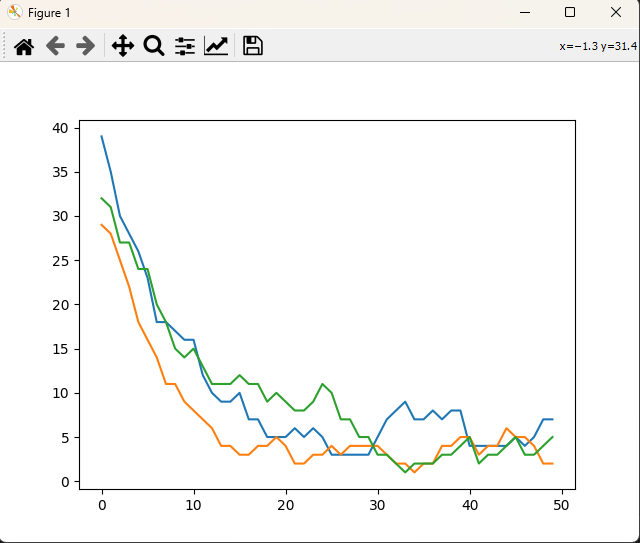

<h3 align="center">Hunter-Prey-Simulator</h3>

Basic hunter prey simulator written in python using matplotlib to graph the results.

### Screenshots

  

#### How to use
It is very easy!
- Download the python file
- Open command prompt and type "pip install matplotlib"
- Then you can run the Python script with alright a display onto a graph

#### Contributing
If you have any idea how to make this app better, please [create a pull request](https://github.com/JaredWestley/Hunter-Prey-Simulator/compare). If you find any bug, please [create an issue](https://github.com/JaredWestley/Hunter-Prey-Simulator/issues/new).

#### License
This project is licensed under GPLv3 and it's libraries under their license. Please check both [LICENSE.txt](LICENSE.txt) and [LICENSE_3rd.txt](LICENSE_3rd.txt).
